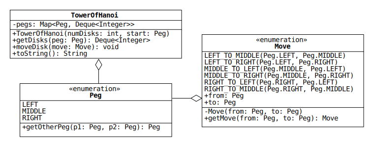

# Lab 9: A Selection of Recursive Algorithms

> To understand recursion, one must first understand recursion.

This well-known computer science joke is an amusing but only partially accurate description of recursive algorithms.
When implemented correctly, a recursive method will not execute infinitely, as the joke suggests.
Rather, each recursion performs a smaller calculation until reaching a simple base case.

In this lab, we will implement a selection of common recursive algorithms.
Stubs for each method can be found in the source file Recursion.java along with Javadoc comments that detail the inputs and outputs.
Additional information about the algorithms is given in the following sections.

## Fibonacci Numbers

The [Fibonacci sequence](https://en.wikipedia.org/wiki/Fibonacci_number) is probably the most common example used to illustrate recursion.
Calculating Fibonacci numbers recursively, however, is much less efficient than calculating them iteratively.

One way to improve the performance of the recursive calculation is to use a technique called "[memoization](https://en.wikipedia.org/wiki/Memoization)."
This works by storing each term in a map after the first time it is calculated.
Subsequent calls to the method will retrieve terms from the map instead of recursing all the way to the base case.

We will implement two recursive methods that calculate Fibonacci numbers: one that uses memoization and one that does not.

## Binary Search

[Binary search](https://en.wikipedia.org/wiki/Binary_search_algorithm) is an efficient algorithm for locating an element in a sorted list.
The algorithm achieves its efficiency by reducing its search range by a factor of 2 after performing each comparison.
For details, see section 12.3 of the textbook.

We will implement a version of binary search that returns a list of the indices of all the elements that the algorithm checks, in the order they are checked.
If the target element is found, the last index in the list is its index.
If the target is *not* found, the last element is -1.

### Hints

* Let `midIdx` be assigned the value `(fromIdx + toIdx) / 2`.
If the element at `midIdx` is not the target, one of the following two updates should occur:

  1. `fromIdx = midIdx + 1`
  2. `toIdx = midIdx - 1`

* The algorithm has two possible base cases:

  1. The target is found.
  2. `fromIdx` is greater than `toIdx`.
  (The target is not in the list.)

* Create the list of indices in the base case.

## Tower of Hanoi

The [Tower of Hanoi](https://en.wikipedia.org/wiki/Tower_of_Hanoi) is a puzzle game invented by the mathematician [&Eacute;douard Lucas](https://en.wikipedia.org/wiki/%C3%89douard_Lucas) in 1883 that is often used to illustrate recursion.
The game consists of three identical pegs and a set of disks with different radii.
Each disk has a hole through its center that allows it to fit onto the pegs.

The game starts with all of the disks stacked on the same peg.
The largest disk is on the bottom and the remaining disks are stacked on top of it in order of decreasing radius, as shown in this picture:


The goal of the game is to transfer all the disks from the starting peg to one of the other pegs.
Only one disk can be moved at a time, and it must be placed on a peg before moving another disk.
Additionally, a disk can only be placed on a peg if its radius is less than the other disks on the peg.

We will write a method that solves the puzzle and a class that represents the state of the game.
A UML diagram for the class is shown below along with diagrams for two related enumerated types.



The code for Peg is included in the repo, and its values represent the three pegs (left, middle, and right).
Peg includes a static method that takes two different pegs and returns the third.
For instance, `getOtherPeg(LEFT, MIDDLE)` returns `RIGHT`.

The code for Move is also included in the repo, and its values represent the six possible moves.
For example, `LEFT_TO_MIDDLE` represents the move that transfers the top disk on the left peg to the middle peg.
Move includes a static method that takes two Peg values and returns the corresponding move.
For instance, `getMove(RIGHT, LEFT)` returns `RIGHT_TO_LEFT`.

TowerOfHanoi represents the state of the game.
It contains a map with a key for each peg.
The map associates each peg with a [stack](https://en.wikipedia.org/wiki/Stack_(abstract_data_type)) of integers that represents the stack of disks on the peg.

A stack is an ideal data structure to represent the disks because only the top disk can be accessed at any time.
(For instance, it's impossible to move the bottom disk before removing the disks on top of it.)
The Java API includes a [Stack interface](https://docs.oracle.com/en/java/javase/11/docs/api/java.base/java/util/Stack.html), but the documentation recommends using the [Deque interface](https://docs.oracle.com/en/java/javase/11/docs/api/java.base/java/util/Deque.html) instead.

"Deque" is short for "[double-ended queue](https://en.wikipedia.org/wiki/Double-ended_queue)," which is a queue that supports adding and removing elements from both the front and the back.
Either end of a deque can be used as a stack.

The Deque interface includes the stack methods `peek`, `push`, and `pop`, which get, add, and remove an element from the front of the deque, respectively.
Use these methods to implement `moveDisk`, which is described along with the other TowerOfHanoi methods below.

* `TowerOfHanoi(int numDisks, Peg start)`: Create a new game with the given number of disks initially stacked on the given peg.
If `numDisks` is not positive, throw an IllegalArgumentException.
Note: [LinkedList](https://docs.oracle.com/en/java/javase/11/docs/api/java.base/java/util/LinkedList.html) implements the Deque interface.

* `getDisks(Peg peg)`: Return a copy of the deque associated with the given peg.

* `moveDisk(Move move)`: Remove the top disk on peg `move.from` and add it to the peg `move.to`.
Throw an IllegalMoveException if either of the following conditions is true:

  1. No disks are on the first peg.
  (That is, the deque associated with `move.from` is empty.)
  2. The radius of the disk is larger than the top disk on the second peg.
  (That is, the integer at the front of the deque associated with `move.from` is larger than the integer at the front of the deque associated with `move.to`.)

  Note: the class IllegalMoveException is included in the repo.

* `toString()`: Return a string representation of the game state using the format below.

  ```
    LEFT: [disks on left peg]
  MIDDLE: [disks on middle peg]
   RIGHT: [disks on right peg]
  ```

  For example, if a game is created by calling `TowerOfHanoi(5, RIGHT)`, its string representation is

  ```
    LEFT: []
  MIDDLE: []
   RIGHT: [5, 4, 3, 2, 1]
  ```

  Note that calling `toString` on the deque associated with the right peg will return the string `[1, 2, 3, 4, 5]`.
  Use the helper method included with the starter code to print the integers in the reverse order.

### Recursive Solution

The Tower of Hanoi has a beautiful recursive solution that is best understood by visualizing an example.
Suppose the game starts in the following state:

```
  LEFT: [4, 3, 2, 1]
MIDDLE: []
 RIGHT: []
```

Let's solve the puzzle by moving the four disks to the right peg.

To do this, assume for the moment that we know how to solve the three-disk puzzle.
Using this knowledge, we can put the game in the following state:

```
  LEFT: [4]
MIDDLE: [3, 2, 1]
 RIGHT: []
```

Notice that this is possible because disk 4 does not constrain the moves of the other disks, since it has the largest radius.
That is, any disk can be placed on disk 4, so we can pretend it doesn't exist when moving disks 1 through 3.

Now that disk 4 is the only disk on the left peg, we can move it to the right peg, which puts the game in this state:

```
  LEFT: []
MIDDLE: [3, 2, 1]
 RIGHT: [4]
```

Finally, we can use the three-disk solution a second time to move disks 1 through 3 to the right peg:

```
  LEFT: []
MIDDLE: []
 RIGHT: [4, 3, 2, 1]
```

The only question that remains is, "How do we solve the three-disk puzzle?"
Fortunately, the same logic applies if we assume that we know how to solve the two-disk puzzle.
The two-disk puzzle, in turn, can be solved if we assume that we know how to solve the one-disk puzzle.
The one-disk puzzle is the base case: simply move the disk to the desired peg.

If you're confused, check out [this Khan Academy page](https://www.khanacademy.org/computing/computer-science/algorithms/towers-of-hanoi/a/towers-of-hanoi), which includes some excellent illustrations.

## Subset Sums

The final recursive algorithm finds all the unique sums that can be calculated from subsets of integers in a given list.
For instance, if the method is given `[1, 2]`, it returns `[0, 1, 2, 3]`, since the possible subsets are `{}` (the empty set), `{1}`, `{2}`, and `{1, 2}`.

This algorithm is similar to other algorithms that explore a full range of possibilities.
If you're having trouble implementing it, be sure to read sections 12.7 and 12.9 in the textbook.
