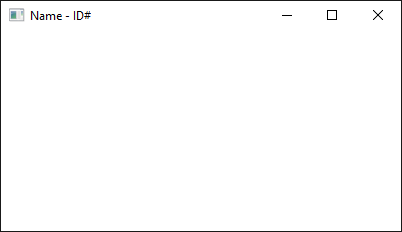

# JavaFX Installation Guide

[JavaFX](https://en.wikipedia.org/wiki/JavaFX) is the standard library used to create graphical desktop applications in Java.
It is the successor to the [Abstract Window Toolkit](https://en.wikipedia.org/wiki/Abstract_Window_Toolkit) (AWT) and [Swing](https://en.wikipedia.org/wiki/Swing_(Java)) libraries.

In 2018, Oracle removed JavaFX from the JDK and made it a standalone module.
This means that to use the library, we have to download and manually include it in the build path of our programs, which is a bit of a chore.
The instructions in this guide will show you how to do this in Eclipse.

These instructions are largely taken from [this site](https://openjfx.io/openjfx-docs/), which you may want to visit if you use an IDE other than Eclipse.
You can find instructions for IntelliJ and NetBeans by clicking on the links on the left side of the page.
The instructions below are based on those for a [non-modular Eclipse project](https://openjfx.io/openjfx-docs/#IDE-Eclipse).

## Download JavaFX

The standalone JavaFX module is hosted by the company Gluon on [this page](https://gluonhq.com/products/javafx/).
Download the JavaFX 11 SDK (not the jmods) for your operating system.

The SDK will be downloaded as a zip file.
Extract the contents of the file to a convenient location on your computer.
On my Windows desktop, for example, I extracted them to the same folder where the JDK is stored.
This creates the following folder: `C:\Program Files\Java\javafx-sdk-11.0.2`.

## Add the JavaFX Library to Eclipse

In Eclipse, click **Window** in the menu bar and then select **Preferences** to open the preferences window.
In the menu on the left side of the window, click the triangle next to **Java** and then **Build Path**.
Select **User Libraries** from the list.

The right side of the window should now show a list of user libraries, which is probably empty.
Click the **New...** button and input `JavaFX11` in the window that appears.
(Pretend the pictures below say `11` instead of `12`.)
Do not check the system library box.
Click **OK** to add the name to the list of user libraries.


Select **JavaFX11** from the list.
Click the button labeled **Add External JARs...** and navigate to the location where you extracted the SDK.
Open the `lib` folder and you should see a bunch of jar files that all begin with the text `javafx` (e.g., `javafx.base.jar` and `javafx.controls.jar`).
Select all of the jar files by clicking on the first, holding shift, and then clicking on the last.
(Do not select the file `src.zip`.)
Click **Open** to add the jars to the user library.


Click **Apply and Close** to close the preferences window.

## Add JavaFX to the Build Path

If you have not done so already, clone this repo to your computer and open it in Eclipse.
(To open the project, click **File** in the menu bar and then select **Open Projects from File System...**.)

Now open the source file `JavaFXExample.java`.
(It's located in the examples package.)
Notice that all of the JavaFX import statements are underlined in red.
This is because Eclipse does not know where to find these classes.
To fix the problem, we need to add JavaFX to the build path.

Right-click the project folder in the package explorer window.
In the dropdown menu, hover on **Build Path** and then select **Configure Build Path...**.
This opens the properties window for the project.

On the right side of the window, click the **Libraries** tab.
Select **Classpath** from the list below the text **Jars and class folders on the build path**, and click the **Add Library...** button.
In the window that appears, select **User Library** and then click the **Next** button.
Check the box next to **JavaFX11** and click **Finish**.

Click **Apply and Close** to close the properties window.
If you followed these steps correctly, the JavaFX11 library will appear in the package explorer along with the JRE System Library, and the import statements in the source file will no longer be underlined.

## Add a Run Configuration

Run the source file `JavaFXExample.java`.
The program will compile, but you will receive the following console message:

```
Error: JavaFX runtime components are missing, and are required to run this application
```

To fix this, we need to pass a couple of arguments to the Java virtual machine so it knows where to find the JavaFX module.

Right-click the source file in the package explorer.
In the dropdown menu, hover on **Run As** and then select **Run Configurations...**.
This opens the run configurations window.

On the right side of the window, click the **Arguments** tab.
In the **VM arguments** box, add the following text:

```
--module-path "<path-to-javafx-lib-folder>" --add-modules javafx.controls,javafx.fxml
```

Replace `<path-to-javafx-lib-folder>` with the path to the folder containing the JavaFX jar files.
For instance, on my Windows machine, these are the correct VM arguments:

```
--module-path "C:\Program Files\Java\javafx-sdk-11.0.2\lib" --add-modules javafx.controls,javafx.fxml
```

Note that Windows file paths use backslashes while macOS file paths use forward slashes.


Click **Apply** and then **Run** to close the run configurations window and run the program.
If you input the arguments correctly, a window will appear that looks like the image below.



Congratulations!
You installed JavaFX and configured, compiled, and ran a program that uses the library.
Keep these instructions handy to help you configure your future JavaFX programs.