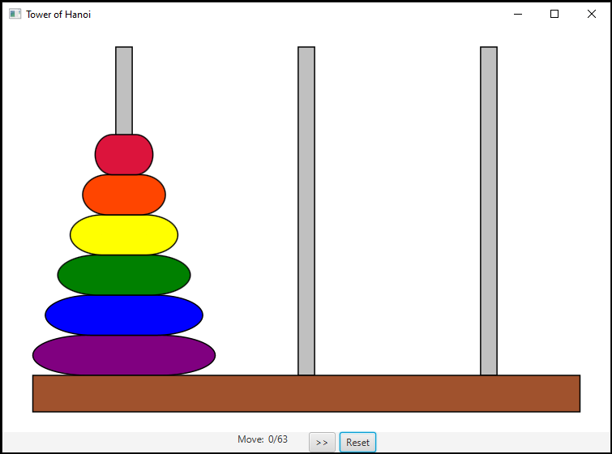

# Lab 10 - UI with JavaFX
*Note: For JavaFX installation instructions, please see the [other .md file](JavaFX_Installation.md).*
## Overview
* Recall the **Tower of Hanoi** problem from our recursion problem set. This program is a graphical demonstration of the step-by-step solution to this problem.

* UI programs are mechanically more complex than the other programs we've worked with, involving lots of fun things like **multi-threading** and **asynchronous event queues**. These are great coffee topics, but they are not important for our course and will likely be covered in a future course.
* In order to avoid thread-related issues, UI programs must be designed properly. To avoid having to fully explain this, while still creating a valuable learning experience with a more complicated codebase, most of the code for this assignment has already been written.

### UI/UX Design - MVC
* The above-mentioned design is a lite version of the MVC (model, view, controller) design pattern. This pattern addresses issues that occur when threads other than the UI thread try to update interface components (since only the single UI thread is allowed to update components, this causes problems).
* This project separates the program into a model and view. The model is responsible for holding/updating the UI objects' data, while the view is responsible for updating the graphical components with that data. 
* Typically a controller is used to facilitate communication between the model and view, but we do not use one because in this particular case it would have been redundant to do so.
* This is another topic you will enjoy in greater detail later on.

## Weekly Bonus Point
* For this week, your participation bonus is earned by successfully installing JavaFX, then getting `JavaFXExample.java` to display a window with your own student name and ID number.
* To get credit, you must make a `commit` to GitHub with a screenshot of the window created when you get the project to run, with your own name and ID number at the top of the window. The name of this screenshot does not matter, but please put the screenshot in the project root directory (the same folder as this readme file).
* When you are ready, let us know and we will verify by visiting your repository on GitHub and ensuring that the screenshot is correct. After this, your point will be awarded.

## Lab Objectives
* You will be required to modify several of the classes. All areas with required changes are marked with `TODO` comments, which can be viewed in the `Tasks` panel in eclipse.

### 0. `Recursion.solveTower` and `TowerOfHanoi.java` Solutions (20%)
* Your solution from the recursion lab will be used for this lab as well. For this reason, the JUnit test file `SolveTowerTest.java` has been included.
* Note that the path to solveTower has been changed to `TowerOfHanoi.solveTower(..)`.

### 1. Drawing Game Components (30%)
* In TowerOfHanoiView.java, you'll implement the `draw()` method.
* In TowerOfHanoiSetupView.java, you'll implement part of `TOH_Simulator.updateView()`.
* ***Note***: if you are changing parts of the game state, but the UI is not updating, make sure that you are calling the appropriate method(s) to re-draw the game components. This has to be done after ***any*** change to the model's data.

### 2. Listeners (50%)
* UI development revolves around the use of `Event`s and `Handler`s (aka `Action`s and `Listener`s) but the simplest is a button's activation handler. In `TowerOfHanoiSetupView.java` you'll be required to write the handler code for `btnForward` and `btnGo`.
* `btnGo` - This code must validate all user input from the settings window before starting the simulation. If any of the input is invalid, an `Alert` of the error type should pop-up with the proper error message.  
*NOTEs: as a hint, we have provided the required error messages as constants. Please see your textbook for more information on the `Alert` API.*
* `btnForward` - This event handler uses methods within `TOH_Simulation` to show the next step of the game's solution.

## Grading
* There is no zyLab for this assignment, so there is no automatic grading.
* After the lab deadline, we will manually grade each submission, making sure that all required functionality exists.
* The exact point breakdown is not given, but percentages are given in the task headers to show the weight of each task.
