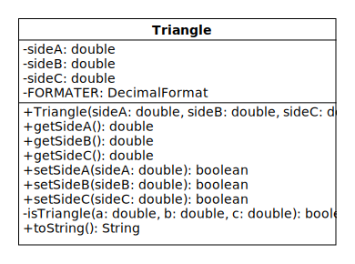

# Lab 2: Encapsulating Triangle Data

In Lab 1 we wrote a class that consisted of nothing but static methods.
In the real world, classes are only occasionally written like this, such as the Math and Arrays classes from the Java API.
In contrast, most classes have instance (i.e., non-static) methods and variables.

A class with instance variables is a bit like a custom data type.
Objects of the class have their own copies of each instance variable.
This allows the objects to represent particular examples of whatever category of things the class represents.

Consider, for example, the String class, which represents an arbitrary sequence of characters.
String objects represent particular character sequences, such as "Java" or "CS 2334" or ":-)".
To accomplish this, the String class has a character array instance variable.
Each String object has its own copy of the array that it uses to store its unique text.

In this lab, we will write a class named "Triangle" that represents any three-sided polygon.
Triangle objects represent particular triangles, such as a [3-4-5 right triangle](https://mathworld.wolfram.com/345Triangle.html).
To accomplish this, the class will have three double instance variables.
Each Triangle object will have its own copies of these variables that it uses to store its side lengths.

While writing the Triangle class, we will contend with the fact that some sets of double values cannot be the lengths of a triangle (e.g., -1, 0, 3).
To ensure that each Triangle object represents an actual triangle, we will use encapsulation to prevent the user of the class from creating objects in invalid states.

## Triangle Class

The members of the Triangle class are shown in the UML (unified modeling language) diagram below.



Recall that class diagrams consist of three compartments that contain the following information:

* Top: class name
* Middle: variable names and data types
* Bottom: method signatures and return types

The list of variables in the middle compartment shows the name of each variable followed by a colon and then its data type.
Similarly, the list of methods in the bottom compartment shows the signature of each method followed by a colon and then its return type.

In addition to this information, special notation indicates which variables are constant, which members are static, and the accessibility of all members:

* Variables with uppercase names are constants and should be declared with the final keyword.
* Underlined members are static.
* Plus and minus symbols represent access modifiers.
Plus means that a member is public; minus means that a member is private.

From the diagram, we can see that Triangle has three instance variables: `sideA`, `sideB`, and `sideC`.
These variables store the lengths of the sides of a triangle.
Because the variables are non-static, each Triangle object has its own copies.
This allows each object to represent a different triangle.

Imagine for a moment how the class would be different if the length variables were static.
If this were the case, Triangle objects would not have unique copies.
All the objects would share the same three length variables.
This would mean that the class could only represent a single triangle.

## Encapsulating the Side Lengths

The design of the Triangle class follows an object-oriented programming principle known as "encapsulation."
This principle dictates that instance variables should be private and public "getter" and "setter" methods should be used to access and modify their values.

For the Triangle class, the getters are `getSideA`, `getSideB`, and `getSideC`, and the setters are `setSideA`, `setSideB`, and `setSideC`.
The getters return the values of `sideA`, `sideB`, and `sideC`, and the setters change the values.

You probably saw this technique used in your previous programming class, but it may not be obvious why it's beneficial.
At first glance, it appears to add needless complexity.
Why don't we just get rid of these methods and make the length variables public?

Later in the semester we'll see that encapsulation has multiple benefits, but there's one in particular that matters here: It allows us to constrain the variable values.
This is important because the sides of a triangle cannot have arbitrary lengths.
For instance, negative side lengths don't make physical sense.
However, if the length variables are public, then a user of our class can create Triangle objects with any side lengths they please, including negative lengths.
Encapsulation allows us to prevent this.

## Side Length Constraints

There are two constraints we need to enforce on the side lengths:

1. Each side must be positive.
2. The sum of any two sides must be greater than the third.

The first constraint applies to any "proper" triangle.
As already mentioned, negative sides are unphysical, but the side lengths also can't be zero, since, by definition, a triangle has three sides.

The second constraint is known as the [triangle inequality](https://en.wikipedia.org/wiki/Triangle_inequality).
If you're unfamiliar with it, try this little experiment.
Touch the tips of your pointer fingers together to form a straight line.
Imagine this line is one side of a triangle.
Now try to form the other two sides with your thumbs.
Unless your thumbs are unbelievably long, you'll quickly see why this is impossible.

Mathematically, the triangle inequality is actually expressed as the following three inequalities, where a, b, and c are the side lengths:


If any one of these inequalities is false, then a, b, and c cannot be the side lengths of a triangle.
(Note that these inequalities exclude the zero-area case, where the sum of two sides is exactly equal to the third.)

In the next section, we'll see that these constraints must be checked in both the constructor and the setters.
We could write identical constraint-checking code in all these methods, but this is [bad practice](https://en.wikipedia.org/wiki/Duplicate_code), since duplicate code blocks make programs more difficult to read and debug.

A better way to reuse our constraint-checking code is to write a helper method.
This is the purpose of `isTriangle` in the UML diagram.
Write this method so that it returns false if either constraint is violated.
The method should return true only if *both* constraints are satisfied.

Finally, note that `isTriangle` is a private static method.
Its accessibility is set to private because only the constructor and setters need to call it.
(The user of the class will be unaware that it exists.)
The method is static because the only data it needs to perform its job are its parameters.
(It doesn't require direct access to the instance variables.)

## Enforcing the Constraints

To ensure that `sideA`, `sideB`, and `sideC` are only assigned valid lengths, the constraints listed in the previous section must be enforced anywhere the user of the class can change their values.
That is, the constraints must be enforced in any public method that can change the length variables.
The Triangle class has four such methods: the constructor (`Triangle`) and the three setters (`setSideA`, `setSideB`, and `setSideC`).

The constructor initializes the length variables after a Triangle object is created with the new operator.
Suppose the constructor is called with an invalid set of arguments like this:

```java
Triangle triangle = new Triangle(1, 1, 3);  // invalid lengths: 1 + 1 <= 3
```

What can the constructor do to prevent an invalid object from begin created?
As we'll see later in the semester, the constructor can throw an exception, which stops the object from being created, but we don't know how to do that yet.
So a Triangle object will be created whether we want it or not.

The only other option is to assign different values to the length variables.
The choice is arbitrary as long as the values are valid, so let's just initialize each side length to 1.

To summarize, here is how the constructor should work:

1. If `isTriangle` returns true, assign the constructor arguments to `sideA`, `sideB`, and `sideC`.
2. If `isTriangle` returns false, assign 1 to each variable instead.

The other methods we need to worry about are the setters.
Fortunately, they're more straightforward to understand than the constructor.
This is because a valid Triangle object will already exist when a setter is called.
The setter just needs to check whether changing its corresponding variable will put the object in an invalid state.
If so, the setter should leave the variable unchanged.

Let's consider an example.
Suppose the user runs the following code:

```java
Triangle triangle = new Triangle(3, 3, 3);
triangle.setSideC(-1);
```

The first line creates an equilateral Triangle with side lengths equal to 3.
This is a valid state for a Triangle object, since the lengths are positive and satisfy the triangle inequality.
The second line tries to assign a negative value to `sideC`.
If successful, the Triangle would be in an invalid state.
To prevent this from happening, the setter leaves the value as 3.

In addition to checking the constraints and possibly modifying a length variable, each setter also returns a boolean value.
This value indicates whether the Triangle was changed.
If the setter updates its length variable, it returns true; otherwise, it returns false.
(When we study the [Java collections framework](https://en.wikipedia.org/wiki/Java_collections_framework), you'll see many mutator methods that return a boolean value like this.)

To summarize, here is how each setter should work:

1. If `isTriangle` returns true with the new side length, assign the value to the corresponding length variable and return true.
2. If `isTriangle` returns false, leave the variable unchanged and return false.

## String Representation

The UML diagram contains one last method that we have not discussed: `toString`.
Implementing this method allows us to define a string representation for our Triangle objects.
Once we've done this, printing a Triangle reference variable will output the object's representation, rather than its memory address.
This can be very useful for debugging a program.

The string representation of an object should include information that makes it unique from other objects of the same class.
For Triangle objects, this information is the side lengths.
Let's write `toString` so that it returns a String with the following format:

```
Triangle(<value of sideA>, <value of sideB>, <value of sideC>)
```

Additionally, let's reduce the length of the String by rounding any values with more than 3 digits after the decimal point to the thousandths place.

To clarify the format, consider this example:

```java
Triangle triangle = new Triangle(1, 1, 1.0/3.0);
System.out.println(triangle);
```

Running the code should output the following text to the console:

```
Triangle(1, 1, 0.333)
```

To perform the rounding, use an object of the [DecimalFormat](https://docs.oracle.com/en/java/javase/11/docs/api/java.base/java/text/DecimalFormat.html) class.
Study the documentation and Google some examples to see how this is done.
In particular, read about the pattern passed to the constructor.

Rather than create a new DecimalFormat object every time `toString` is called, assign an object to the constant `FORMATER`.
Because this constant is static, it can be used by all the Triangle objects.

## Getting Started

As in the previous lab, the code in your GitHub repo is preconfigured to run in Eclipse and includes a JUnit test class.
Follow the Lab 1 instructions to download the code and import the project.

The Triangle class included in the repo is empty, so the method calls in TriangleTest will be underlined in red.
Use the Triangle UML diagram to declare the variables in the middle compartment and write stubs for the methods in the bottom compartment.
Once the stubs are complete, write the body of each method to pass the tests.

## Commit Code to GitHub

This week you will submit your code in two places.
First, upload Triangle.java to zyLabs using the link on the Lab 2 Canvas page.
Next, commit the file to your GitHub repo.
Below are instructions on how to do this:

1. Open the homepage of your Lab 2 repo.
(If you opened one of the files, click the "<> Code" link in the top-left corner to return to the homepage.)

2. Click the "Add file" button at the top of the file browser.

3. Select "Upload files" from the drop-down menu.

4. A new page will open with a rectangle that contains the text "Drag additional files here to add them to your repository."
We want to add Triangle.java to the src folder so that it overwrites the empty class.
In order to do this, drag and drop the entire src folder from your Eclipse project into the browser.
(If you drag and drop only Triangle.java, the file will be added to the root of the repo.)

5. Scroll down the page to the rectangle that says "Commit changes."
Type a message in the text box that currently says "Add files via upload."
The message should be a [concise description](https://chris.beams.io/posts/git-commit/) of the changes to the repo.
Something like "Implement all Triangle methods" is a good choice.
(Notice that it's written in the imperative mood and does not end with a period.)

6. Make sure the radio button is set to "Commit directly to the master branch" and then click the green "Commit changes" button.

7. Open Triangle.java in the GitHub file browser to check that your changes were added.
