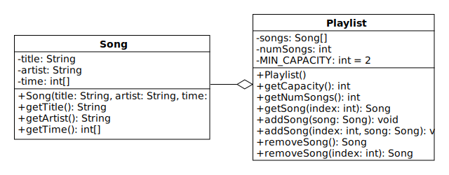

# Lab 3: Aggregating Songs

In object-oriented programming, aggregation is a relationship between two classes where objects of one class contain objects of the other.
In this lab, we will implement two such classes: Song and Playlist.
Each object of the Song class represents a single musical composition.
Each object of the Playlist class represents an ordered, modifiable list of songs.

Aggregation is represented in UML diagrams by a line with an empty diamond on
one end that connects two classes.
Objects of the class touching the diamond contain objects of the other class.
The following is a class diagram for the Song and Playlist classes:

## Song Class

Each Song object contains two Strings and an integer array.
These fields store the title, artist, and duration (time) of a song.

The time array has either one, two, or three elements that store the number of seconds, minutes, and hours respectively.
Each element is greater than or equal to 0, and the seconds and minutes are limited to the inclusive range from 0 to 59.
If the duration of the song is less than an hour, the hours element is omitted.
Similarly, if the song is less than a minute, both the minutes and hours elements are omitted.

Consider, for example, the song "So What" by Miles Davis, which is 9 minutes and 22 seconds long.
A Song object that contains this data will store "So What" and "Miles Davis" in the title and artist fields, and it will store [22, 9] in the time field.
The array has only two elements because the duration of the song is less than an hour.

In the previous lab, we used encapsulation to handle invalid input passed to a class's constructor and setters.
In this lab, we will **assume that the Song constructor is always given valid data**.
In particular, we will assume that the integer array always satisfies the description above.

Instead of checking the constructor input for errors, we're going to use encapsulation for another purpose.
We're going to make Song an immutable class.
"Immutable" means that objects of the class cannot be changed after they're constructed.

Notice that the Song class does not have any setters.
This prevents the title and artist fields from changing.
It does not, however, prevent the time array from changing.
If the user of our class has a reference to the array, the reference can be used to change the elements without a setter.
(Why isn't this a problem for the String fields?)

To keep this from happening, make copies of the time array.
Note that a copy must be made in two methods: (1) in the constructor, before assigning the reference to `time`, and (2) in `getTime`, before returning the reference.
To simplify your code, try using the copyOf method from the [Arrays class](https://docs.oracle.com/en/java/javase/11/docs/api/java.base/java/util/Arrays.html) instead of a for-loop.

## Playlist Class

Each Playlist object contains a reference to an array of Song objects that is stored in the songs field.
When a Playlist object is constructed, a new Song array is also constructed.
The array is initially empty, but Songs can be added and removed by calling the addSong and removeSong methods.

In CS 1323/1324, we used the adjective "oversize" to describe arrays such as this, which have extra space for adding data.
An oversize array has both a capacity and a size.
The capacity is the length of the array, and the size is the number of elements treated as non-empty.
(For instance, if an array has a capacity of 8 and a size of 6, we treat the first 6 elements as valid data and the last 2 as empty space.)
In a Playlist object, the size of the Song array is stored in the numSongs field.

The size of an oversize array can never exceed its capacity.
If `addSong` is called when `songs` is full, a new array must be constructed.
The new array is made twice as long, and all the Songs are
copied from the old to the new array.
The new Song can then be added.

If the size of an oversize array becomes far less than its capacity, the array wastes space.
To prevent this, `removeSong` halves the capacity after removing a Song if the resulting size is one-quarter or less of the current capacity.
This is accomplished by making a new array that is half as long and copying the Songs from the old to the new array.

Below is additional information about the methods:

* `Playlist()`: Construct a Playlist with capacity equal to `MIN_CAPACITY`.

* `getCapacity()`: Return the length of `songs`.

* `getNumSongs()`: Return the number of Songs stored in the Playlist.

* `getSong(int index)`: Return the Song with the given index in `songs`.
If the given value is less than 0 or greater than the index of the last Song, return null.

* `addSong(int index, Song song)`: Assign the given Song to the element of `songs` with the given index.
If the given index is less than 0 or greater than the index of the last Song plus 1, do nothing.

  Before adding the Song, prepare the array in the following two ways:
  (1) If the array is full, double the capacity.
  (2) Make room for the new Song by shifting the existing Songs.
  Shift any Song with an index greater than or equal to the given index up to the next-highest index.

* `addSong(Song song)`: Assign the given Song to the first empty element of `songs`.
Use the other addSong method to implement this method in a single line.

* `removeSong(int index)`: Remove and return the Song with the given index in `songs`.
If the index is less than 0 or greater than the index of the last Song, return null.

  Before returning the Song, shift any Song with a larger index down to the next-lowest index.
  If the resulting number of Songs is one-quarter or less of the capacity, halve the capacity.
  However, don't reduce the capacity below `MIN_CAPACITY`.

* `removeSong()`: Remove and return the last Song in `songs`.
Use the other removeSong method to implement this method in a single line.

Doubling and halving the capacity of `songs` requires a new array to be constructed and the Songs copied from the old to the new array.
This can be done manually with a for-loop.
However, to avoid bugs and duplicate code, consider using the copyOf method from the [Arrays class](https://docs.oracle.com/en/java/javase/11/docs/api/java.base/java/util/Arrays.html).
