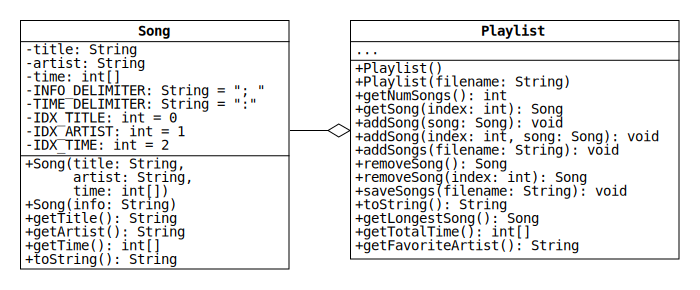

# Lab 4: Reading and Writing Playlists

In Lab 3 we wrote classes that can be used to create playlists of songs.
One limitation of these classes is that Playlist objects are lost when a program stops.
In this lab, we will expand Song and Playlist so that the state of a Playlist object can be saved and loaded from a text file.
The new UML diagram is shown below.



If you passed the Lab 3 test cases, feel free to reuse your code in this lab.
If not, your repo contains starter code for Song and Playlist.
The starter code for Song will pass all of the unit tests from the previous lab.
The starter code for Playlist, however, will fail the assert statements that check the capacity.
This is because Playlist has been [refactored](https://en.wikipedia.org/wiki/Code_refactoring) to use an [ArrayList](https://docs.oracle.com/en/java/javase/11/docs/api/java.base/java/util/ArrayList.html).
Either version of the class can be used to complete this assignment, which is why the Playlist diagram no longer specifies its fields.

## Song Class

The Song class has been expanded with a second constructor and a toString method.
The constructor initializes Songs by parsing information stored in Strings.
The toString method returns String representations of Songs in the format parsed by the constructor.

* `Song(String info)`: Initialize a Song by parsing a String that contains the title, artist, and time with a semicolon and a space used as the [delimiter](https://en.wikipedia.org/wiki/Delimiter).
For example, the info String for the song "Where the Streets Have No Name" by U2 is

  ```java
  "Where the Streets Have No Name; U2; 5:36"
  ```

  The time is given as a number of hours, minutes, and seconds separated by colons.
  The minutes and seconds are numbers between 0 and 59.
  If the song is less than an hour, only the minutes and seconds are given.
  Similarly, if the song is less than a minute, only the seconds are given.

* `toString()`: Return a String representation of the Song in the same format as the info Strings parsed by the new constructor.
For example, suppose a Song is instantiated with the following code:

  ```java
  Song song = new Song("Where the Streets Have No Name", "U2", new int[] {36, 5});
  ```

  Calling `song.toString()` returns the info String shown above.

  If the song is longer than a minute, pad the number of seconds with a leading 0 if it is less than 10.
  Similarly, if the song is longer than an hour, ensure that the number of minutes also has two digits.

### Song Hints

* Use the split method of the [String class](https://docs.oracle.com/en/java/javase/11/docs/api/java.base/java/lang/String.html) to break an info String into pieces.
* Use the static constants shown in the class diagram to remove [magic numbers](https://en.wikipedia.org/wiki/Magic_number_(programming)) from your code.
For instance, pass `INFO_DELIMITER` to the split method, rather than `"; "`.
This will make your code more readable.
* The [Integer class](https://docs.oracle.com/en/java/javase/11/docs/api/java.base/java/lang/Integer.html) has a method that can convert a String of digits to an int.
* The easiest way to pad an int with zeros is to use the format method of the [String class](https://docs.oracle.com/en/java/javase/11/docs/api/java.base/java/lang/String.html).
Pass the method the format String `"%02d"`, which indicates that the int should be formatted as a String of two or more digits.

## Playlist Class

The Playlist class has been expanded with methods to read and write song information to text files.
Methods have also been added that return the longest Song, the total time, and the most frequent artist.

* `Playlist(String filename)`: Initialize a Playlist by parsing a text file of info Strings with the given name.
The resulting Playlist contains a Song for each line of the file, and the Song order matches the order of the info Strings.

* `addSongs(String filename)`: Read a file of info Strings with the given name.
For each line of the file, create a Song and add it to the end of the Playlist.

* `toString()`: Return the String representations of the Songs joined by newline characters (`"\n"`).
Do not terminate the resulting String with a newline character.
For example, suppose a Playlist contains the songs "Resistance" and "Madness" by Muse.
Calling `toString` returns

  ```java
  "Resistance; Muse; 5:46\nMadness; Muse; 4:39"
  ```

* `saveSongs(String filename)`: Save the output of `toString` to a file with the given name.
Overwrite the contents of the file if it already exists.

* `getLongestSong()`: Return the longest Song.
If the Playlist is empty, return null.
If there is a tie for longest Song, break the tie by returning the Song with the smallest index.

* `getTotalTime()`: Return the total time of all the Songs as an array of integers.
Use the same format as the time field in the Song class.

* `getFavoriteArtist()`: Return the artist that appears most frequently.
If the Playlist is empty, return null.
If there is a tie, return the artist that appears first.

### Playlist Hints

* The constructor can be implemented in just two lines.
First, [use `this` to call the other constructor](https://docs.oracle.com/javase/tutorial/java/javaOO/thiskey.html).
Next, call `addSongs` to read the file.
* Implement `addSongs` by reading each line of the file and passing it to the new Song constructor.
* Consider using a StringBuilder to implement `toString`.
Initialize the StringBuilder with the first Song and then loop over the remaining Songs.
On each iteration, append a newline character followed by the next Song.
* Use nested for-loops to implement `getFavoriteArtist`.
For each artist, count the number of times the artist appears in the Playlist.
Use a variable to keep track of the largest count.

## Reading and Writing Files

In your first programming course, you may have used the Scanner and PrintWriter classes to read and write files.
You're welcome to use those classes here, but it's worth learning to use [BufferedReader](https://docs.oracle.com/en/java/javase/11/docs/api/java.base/java/io/BufferedReader.html) and [BufferedWriter](https://docs.oracle.com/en/java/javase/11/docs/api/java.base/java/io/BufferedWriter.html) as well.
Objects of these classes can be created with the following statements:

```java
BufferedReader br = new BufferedReader(new FileReader(filename));
BufferedWriter bw = new BufferedWriter(new FileWriter(filename));
```

Call `readLine` on a BufferedReader to read the next line of a text file.
The method returns null after it reads the last line.
Call `write` on a BufferedWriter to write a given String to a text file.
After you are done reading or writing, call `close`.

Any method that uses a BufferedReader or BufferedWriter must be able to throw an input-output
exception.
To do this, import `java.io.IOException` and add `"throws IOException"` after the method's parameter list.
(For an example, see the helper method checkFile at the end of the PlaylistTest class.)
We'll learn much more about exceptions later in the semester.

## Using the Eclipse Debugger

The Eclipse debugger can make it much easier to understand why your code is failing a unit test.
If you're unfamiliar with the debugger, please watch the first 10 minutes of [this video](https://www.youtube.com/watch?v=9gAjIQc4bPU).
