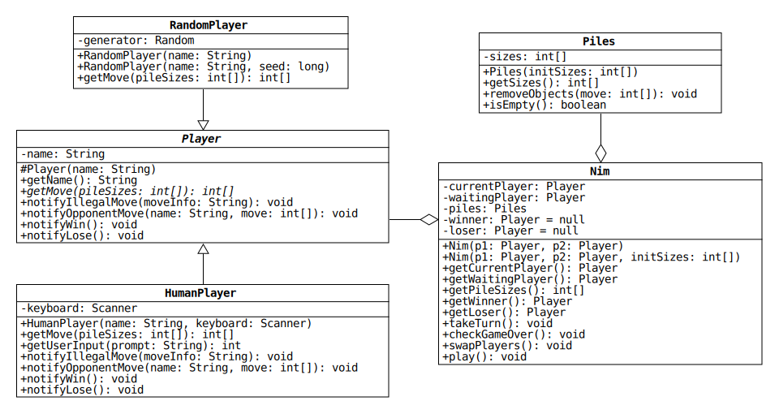
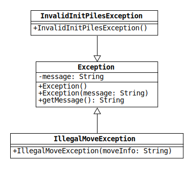

# Lab 6: An Exceptional Game of Nim

[Nim](https://en.wikipedia.org/wiki/Nim) is an ancient two-player strategy game that is played with a collection of identical objects organized into piles.
The number and sizes of the piles can change from game to game, but 3-4-5 and 1-3-5-7 are commonly used.
Players take turns removing one or more objects from any single pile until none remain.
The loser is the player that removes the last object.

In this lab, we will use our newly acquired knowledge of exceptions and abstract classes to write a Nim video game!
Below is example output from the game in which I vanquish my computer opponent, the RandomBot.
After passing the unit tests, you can challenge the RandomBot yourself by running the main method in the included Driver class.

```
Piles: [3, 4, 5]
Enter pile index: 0
Enter object number: 2
RandomBot removed 3 from pile 2.

Piles: [1, 4, 2]
Enter pile index: 1
Enter object number: 1q
Enter object number: 1
RandomBot removed 1 from pile 0.

Piles: [0, 3, 2]
Enter pile index: 1
Enter object number: 0
Nonpositive object number: 0

Piles: [0, 3, 2]
Enter pile index: 1
Enter object number: 1
RandomBot removed 2 from pile 2.

Piles: [0, 2, 0]
Enter pile index: 1
Enter object number: 1
RandomBot removed 1 from pile 1.

Nice job, human. You win!
```

## Clone Your Repo

Future projects in this course will require you to commit your code to GitHub.
Part of your grade will depend on the number of commits and the quality of the messages.

This could be a difficult task if you don't practice on the lab assignments.
Please use the instructions from Lab 5 to clone this repo and commit your code from the command line.
Try to commit each time you pass a unit test.

If you had problems using the command line in Lab 5, here are a couple of things to keep in mind:

1. The `add`, `commit`, and `push` commands only work if you're inside the directory that contains the .git folder.
If you receive an error that says "not a git repository," you're in the wrong directory.
Use the `ls` and `cd` commands to change directories.

2. Use the command `git status` to check if there are files in your repo that have changed since your last commit.
Calling this command before and after `add`, `commit`, and `push` will help you understand how git works.

## Program Overview

The structure of the program is shown in the UML diagram below.
(See the pdf in the uml folder for a larger version.)
The Nim class uses the Player and Piles classes to simulate a game of Nim.
Each Nim object contains two Player objects and one Piles object.



The Player class is abstract, which is indicated by italicized font.
It has one abstract method, getMove, that is overridden in its two non-abstract (concrete) subclasses: RandomPlayer and HumanPlayer.

Much of the code in these classes has already been written for you.
The Player class in your repo is complete, and the Nim and HumanPlayer classes are each only missing a single method.

## Custom Exception Classes

Take another look at the example output in the introduction.
Notice that the game is able to recover from my invalid input on moves two and three.

On my second move, I entered "1q" instead of an integer, which caused the game to prompt me for an object number twice.
On my third move, I tried to avoid taking any objects by entering an object number of 0.
This is an illegal move, so the game asked me for a different move.

This resilient behavior is accomplished by throwing and catching exceptions.
To facilitate it, we will write a couple of custom exception classes, which are shown in the diagram below.



InvalidInitPilesException is thrown when the Piles constructor is given an invalid array of pile sizes.
IllegalMoveException is thrown when removeObjects is called on a Piles object with an illegal move.

Both exceptions inherit from the Java API class Exception.
This class has a private field that stores a String given to its one-argument constructor.
The String can be used to store information about the cause of an exception.

Use the one-argument Exception constructor to initialize IllegalMoveException.
Use the no-argument constructor to initialize InvalidInitPilesException.

## Piles Class

Piles represents the piles of identical objects in a game of Nim.
The class encapsulates the pile sizes and throws exceptions to enforce the rules of the game.

* `Piles(int[])`: Initialize a new Piles object with the sizes in the given array.
Copy the array to ensure that the sizes can only change by calling `removeObjects`.

  The constructor should throw an InvalidInitPilesException if either of the following conditions is true:

  1. The array reference is null or the array has zero length.
  2. Any element of the array is not positive.
  (None of the piles can initially be empty.)

* `getSizes()`: Return an array with the current pile sizes.
Make a copy of the sizes field before returning it to protect the data.

* `isEmpty()`: Return true if all the piles are empty.
Otherwise, return false.

* `removeObjects(int[])`: Remove objects from one of the piles.
The input is a two-element array that represents a player's move.
The array has the format [index, number].
The first element is the index of one of the piles.
The second element is the number of objects to remove.

  The method should throw an IllegalMoveException if any of the conditions listed below is true.
  Check the conditions in the given order.

  1. If the array reference is null, throw an IllegalMoveException with the message `"null move"`.

  2. If the array has a length other than 2, use the message `"Invalid length: <length>"`.
  (Replace `<length>` with the length of the array.)

  3. If the pile index is out of bounds, use the message `"Pile index out of range: <index>"`.
  (Replace `<index>` with the pile index.)

  4. If the pile has a size of 0, use the message `"Pile <index> is empty."`.

  5. If the object number is less than or equal to 0, use the message `"Nonpositive object number: <number>"`.

  6. If the object number is greater than the pile size, use the message `"Object number greater than pile size: <number> > <size>"`.

## Player Class

The abstract Player class provides a common set of methods that the Nim class uses to interact with all player types.
This simplifies the game code by allowing Nim to treat HumanPlayers and RandomPlayers in the same way.
In fact, the Nim class does not know which players are controlled by a human and which are controlled by the computer.

The most important method in the Player class is `getMove(int[])`, which must be overridden by any non-abstract subclass.
This method takes an array with the pile sizes and returns a two-element array that represents the player's move.
The move array has the same format described in the previous section: [pile index, object number].

The remaining Player methods are all non-abstract.
Most of them are used by Nim to notify a player that something important has happened (e.g., they've won the game).
Subclasses of Player can choose to override these methods to implement special behavior.
For instance, HumanPlayer uses these methods to print information to the console.

Your repo contains a complete version of the Player class.
You do not need to modify any of the code.
However, please take a few minutes to study it before trying to write the methods described in the next sections.

## RandomPlayer Class

RandomPlayer is an implementation of Player that makes choices with a random number generator.
It does not override any of the concrete Player methods.

* `RandomPlayer(String, long)`: Use the given long value as a seed to initialize the generator field.
(See the documentation for the [Random class](https://docs.oracle.com/en/java/javase/11/docs/api/java.base/java/util/Random.html).)

* `getMove(int[])`: Return a random legal move.
(Use the method `nextInt(int)` from the Random class.)

## HumanPlayer Class

HumanPlayer is an implementation of Player that gets moves from the user via the keyboard and prints information about the game to the console.
All of the methods have been written for you except one.

* `getUserInput(String)`: Read and return an integer input by the user.
If the input cannot be parsed as an integer, continue to prompt and read until an integer is found.

  The method should perform the following steps:

  1. Print the given String to `System.out` without a trailing newline character.
  2. Read and return an integer using the Scanner (the keyboard field).
  3. If the Scanner throws an InputMismatchException, catch it and call `nextLine` to get rid of the invalid input.
  4. Loop back to step 1.

## Nim Class

The Nim class uses the Piles and Player classes to simulate a game of Nim.
All of its methods have been written for you except one.

* `takeTurn()`: Get the next move from the current player and apply it to the piles.
If the move is legal, notify the waiting player.
If the move is illegal, notify the current player and ask for another move.

  The method should perform the following steps:

  1. Get a move from the current player.
  2. Try to remove the specified number of objects from the piles.
  3. If the move is successful, notify the waiting player by calling `notifyOpponentMove` and passing it the current player's name and move.
  Then return.
  4. If the Piles object throws an IllegalMoveException, catch it and notify the current player by calling `notifyIllegalMove` and passing it the exception message.
  5. Loop back to step 1.
